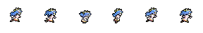

# Fire Emblem Engage — Custom Unit Support

[简体中文](README.md)

**v0.2** · Paired-dining dialogue fallback and six-frame PNG Loading dots.

**Install [Cobalt](https://github.com/Raytwo/Cobalt) first.** Thank you to **Raytwo** for developing and maintaining Cobalt and providing the mod-loading foundation used by this project.

The current binary targets Fire Emblem Engage 2.0.0 with Cobalt 1.31.0 as its compatibility baseline.

## New in v0.2

### Six-frame Loading dots

When native Loading setup cannot find a character texture, this plugin reads the actual converted UnitIconID from enabled Cobalt packages. Preferred resource: `patches/icon/loading/Dot_Run_<UnitIconID>.png` — a transparent **288×48 RGBA PNG containing six 48×48 frames in one horizontal row**, with matching spelling and case. This is one sprite sheet; GIFs and six separate files are not runtime inputs. A corresponding Loading Bundle remains a fallback when no usable PNG is present. Missing or invalid resources are skipped.

**MOD creators must make their own six-frame Loading PNGs.** This plugin provides resource loading and native animation support; it does not create the artwork. The supplied Lumera example was made by the project author. Other characters still require their MOD creators to make the corresponding sprite sheets.

#### Lumera PNG example

Example file: [`lumera-loading-run-six-frames.png`](images/lumera-loading-run-six-frames.png). This author-made Lumera Loading animation uses a transparent **288×48 RGBA PNG**, with six **48×48** frames arranged horizontally. MOD creators can use it as a reference for the sprite-sheet format and resource setup.

To use it in Lumera's character package, rename the downloaded example to `Dot_Run_555Lumiere.png` and place it at `patches/icon/loading/Dot_Run_555Lumiere.png`. The example's descriptive filename is for documentation; the runtime filename must match Lumera's actual UnitIconID, `555Lumiere`. For another character, supply that character's own six-frame sheet with the matching key. The NRO does not generate missing artwork.

The native game still chooses the Loading mode, invitation participants or sortie roster, and drives the six-frame animation. Loading screens without the native dot queue do not gain a forced queue. The v0.2 implementation restores a retained material template before clearing a custom slot, protects cached textures against Unity asset unloading, and reloads an invalid cache entry. These changes address white squares on subsequent Loading screens.

The standard build does not emit plugin diagnostic logs. Resources are cached during a game session; editing a PNG or ZIP requires a full game restart.

## v0.1 Features

### Paired dining

- Provides a fallback for paired-dining combinations without a dedicated conversation label.
- Only an empty label triggers the original meal-evaluation helper, selecting good/normal/bad reactions according to the character, dish quality and preferences.
- Existing valid paired-dining labels are retained.

### Dining scenes

The screenshot below shows the opening scene of a paired meal involving a custom added character. In the author's tests, affected pairs frequently freeze after this scene when the patch is absent. Some pairs lack a dedicated conversation label; the original flow receives an empty label and cannot continue normally. This patch falls back to the native meal-evaluation dialogue selection at that point.

With the patch enabled, the following screenshots show this pair continuing into normal meal-evaluation dialogue. Support notifications shown here belong to the normal game flow. The patch prevents a missing conversation label from blocking the meal; it does not create extra support events.

## Download and Installation

v0.2 binary: [`engage_custom_unit_support.nro`](Releases/engage_custom_unit_support.nro); checksums: [SHA256SUMS](Releases/SHA256SUMS).

1. Install the prerequisite runtime using Cobalt's instructions.
2. Place the new NRO in `engage/mods/engage-custom-unit-support/` and fully restart the game.
3. **Remove the old `engage_dining_pair_fix.nro` when upgrading.** Old and new names contain the same dining hook and must not run together. If your mod collection already includes this plugin, use that copy without a separate installation.
4. Keep Loading PNG resources in the corresponding character package; installing only the NRO does not add artwork.

## Upgrading from the previous project name

Previously named `engage-dining-pair-fix`, this project is now `engage-custom-unit-support`. The v0.2 NRO is `engage_custom_unit_support.nro`. It includes the original dining fix; installing both NRO names creates duplicate hooks. Replace the old NRO when upgrading.

## Source and Build

See [Build instructions](docs/BUILD.md). The source includes both features and the local dependencies used by them. Builds go to `dist/`; `Releases/` contains the v0.2 binary and its checksum.

## License and Credits

Project-owned additions and documentation use the [Apache License 2.0](LICENSE). Third-party dependencies, upstream-derived code and resources retain their respective license terms and notices; see [THIRD_PARTY.md](THIRD_PARTY.md) and [NOTICE](NOTICE).

Thanks to [Raytwo](https://github.com/Raytwo/Cobalt), [skyline-rs](https://github.com/skyline-rs) and all relevant dependency contributors.
