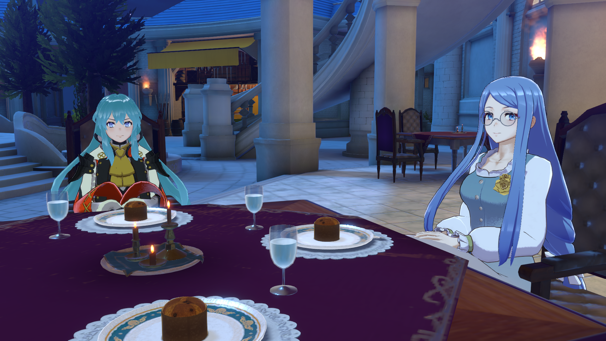
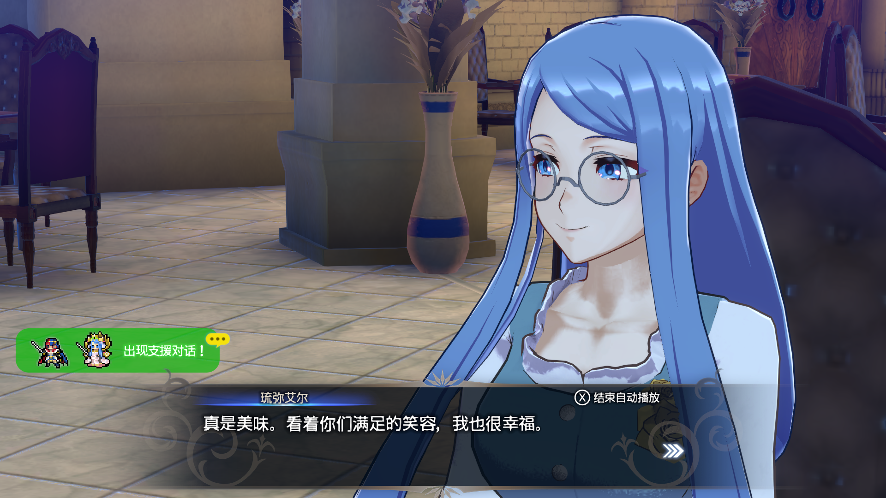
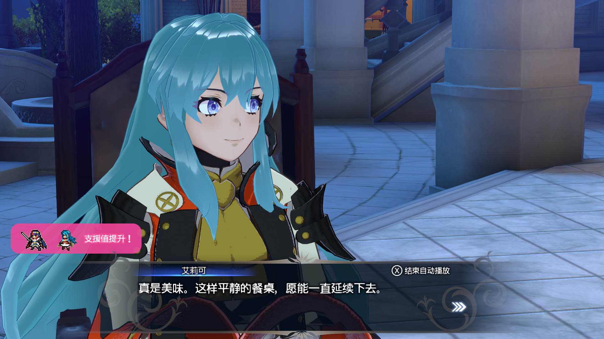

# Fire Emblem Engage — Paired Dining Dialogue Fallback Fix

[简体中文](README.md)

Initial release: **[v0.1](https://github.com/haitei155/engage-dining-pair-fix/releases/tag/v0.1)**.

**Install [Cobalt](https://github.com/Raytwo/Cobalt) first.** Thank you to **Raytwo** for developing and maintaining Cobalt and providing the mod-loading foundation used by this project.

The current binary targets Fire Emblem Engage 2.0.0 with Cobalt 1.31.0 as its compatibility baseline.

## Features

- Provides a fallback for paired-dining combinations without a dedicated conversation label.
- Only an empty native label triggers the original meal-evaluation helper, selecting good/normal/bad reactions according to the character, dish quality and preferences.
- Existing valid paired-dining labels are retained.
- The current release installs one label hook; diagnostics are disabled by default.

## Affected Scene and Successful Continuation

The screenshot below shows the opening scene of a paired meal involving a custom added character. In the author's tests, affected pairs frequently freeze after this scene when the patch is absent. Some pairs lack a dedicated conversation label; the original flow receives an empty label and cannot continue normally. This patch falls back to the native meal-evaluation dialogue selection at that point.

With the patch enabled, the following screenshots show this pair continuing into normal meal-evaluation dialogue. Support notifications shown here belong to the normal game flow. The patch prevents a missing conversation label from blocking the meal; it does not create extra support events.

## Download and Installation

Current binary: [`engage_dining_pair_fix.nro`](Releases/engage_dining_pair_fix.nro); checksums: [SHA256SUMS](Releases/SHA256SUMS).

1. Install the prerequisite runtime using Cobalt's instructions.
2. Place the NRO in `engage/mods/engage-dining-pair-fix/` and fully restart the game.
3. If the 12 Emblems integration package already contains this plugin, use that included copy and avoid installing another standalone copy.

## Source and Build

See [Build instructions](docs/BUILD.md). This snapshot includes the current implementation and the local dependencies used by it. New builds go to `dist/`, preserving the release binary in `Releases/`.

## License and Credits

Project-owned additions and documentation use the [Apache License 2.0](LICENSE). Third-party dependencies, upstream-derived code and resources retain their respective license terms and notices; see [THIRD_PARTY.md](THIRD_PARTY.md) and [NOTICE](NOTICE).

Thanks to [Raytwo](https://github.com/Raytwo/Cobalt), [skyline-rs](https://github.com/skyline-rs) and all relevant dependency contributors.
